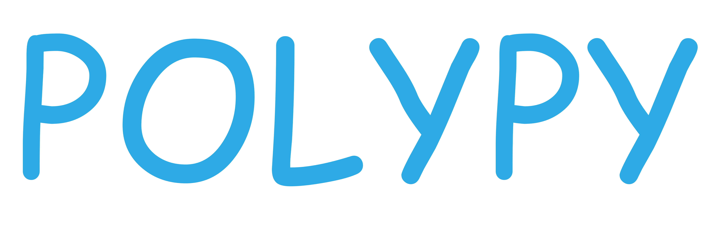

This is the documentation for the open-source Python project - `polypy`.
A library designed to facilitate the analysis of `DL_POLY <https://www.scd.stfc.ac.uk/Pages/DL_POLY.aspx>`_ and `DL_MONTE <https://www.ccp5.ac.uk/DL_MONTE>`_ calculations.
`polypy` is built on existing Python packages that those in the solid state physics/chemistry community should already be familiar with.
It is hoped that this tool will bring some benfits to the solid state community and facilitate data analysis and the generation of publication ready plots (powered by Matplotlib.)

The main features include:

1. **Method to analyse the number denisty of a given species in one and two dimensions.**  

   - Generate a plot of the total number of species in bins perpendicular to a specified direction.  
   - Generate a plot of the total number of species in cuboids parallel to a specified direction.  

2. **Method calculate the charge density from the number density.**  

   - Convert number densities of all species in bins perpendicular to a specified direction into the charge density.  

3. **Calculate the electric field and electrostatic potential from the charge density.**  

   - Solves the Poisson Boltzmann equation to convert the charge density into the electric field and the electrostatic potential.

4. **Calculate the diffusion coefficient for a given species from a mean squared displacement.**

   - Carries out a mean squared displacement on an MD trajectory.
   - Calculates the diffusion coefficient.
   - Uses the density analysis and the diffusion coefficient to calculate the ionic conductivity. 

.. image:: Figures/Show_off.png
    :align: center

The code has been developed to analyse DL_POLY and DL_MONTE calculations however other codes can be incorporated if there is user demand. 
`polypy` was developed during a PhD project and as such the functionality focuses on the research questions encountered during that project, which we should clarify
are wide ranging. Code contributions aimed at expanding the code to new of problems are encouraged. The code has been developed to analyse DL_POLY and DL_MONTE calculations however other codes can be incorporated if there is user demand. Other formats, such as pdb or xyz can be converted to `DL_POLY` format with codes such as `<atomsk <https://atomsk.univ-lille.fr/>`_. and then analysed with `polypy`. Users are welcome to increase the file coverage by adding a reading function for a different format. This can be accomplished by adding to the `read` module which has a class for each unique file type that converts it to a `polypy.read.trajectory` object. 

`polypy` is free to use.

Usage
-----

A full list of examples can be found in the examples folder of the git repository, these include both the Python scripts and jupyter notebook tutorials which combine the full theory with code examples. It should be noted however that DL_POLY HISTORY files and DL_MONTE ARCHIVE files are sizable (1-5GB) and as such only short example trajectories are included in this repository. Notebooks are provided here to illustrate the theory but are not practicle.

Installation
------------

`polypy` is a Python 3 package and requires a typical scientific Python stack. Use of the tutorials requires Anaconda/Jupyter to be installed.

To build from source:

.. code-block:: bash 

    pip install -r requirements.txt

    python setup.py build

    python setup.py install

Or alternatively install with pip

.. code-block:: bash

    pip install polypy

Using conda, 

.. code-block:: bash

    conda skeleton pypi polypy

    conda build polypy
    
    conda install --use-local polypy

Tests
-----

Tests can be run by typing:

    python setup.py test

in the root directory. 

Documentation
-------------

To build the documentation from scratch
  
.. code-block:: bash

    cd docs

    make html

License
-------

`polypy` is made available under the MIT License.

Detailed requirements
---------------------

`polypy` is compatible with Python 3.5+ and relies on a number of open source Python packages, specifically:

- Numpy
- Scipy
- Matplotlib

Contributing
------------

Contact
~~~~~~~

If you have questions regarding any aspect of the software then please get in touch with the developer Adam Symington via email - ars44@bath.ac.uk.
Alternatively you can create an issue on the `Issue Tracker <https://github.com/symmy596/PolyPy/issues>`_.

Bugs
~~~~

There may be bugs. If you think you've caught one, please report it on the `<Issue Tracker <https://github.com/symmy596/PolyPy/issues>`_.
This is also the place to propose new ideas for features or ask questions about the design of `polypy`. Poor documentation is considered a bug
so feel free to request improvements.

Code contributions
~~~~~~~~~~~~~~~~~~

We welcome help in improving and extending the package. This is managed through Github pull requests; for external contributions we prefer the
`"fork and pull" <https://guides.github.com/activities/forking/>`__
workflow while core developers use branches in the main repository:

   1. First open an Issue to discuss the proposed contribution. This
      discussion might include how the changes fit surfinpy's scope and a
      general technical approach.
   2. Make your own project fork and implement the changes
      there. Please keep your code style compliant with PEP8.
   3. Open a pull request to merge the changes into the main
      project. A more detailed discussion can take place there before
      the changes are accepted.

For further information please contact Adam Symington, ars44@bath.ac.uk

Future
~~~~~~

Listed below are a series of useful additions that we would like to make to the codebase. Users are encouraged to fork the repository and work on any of these problems. Indeed, if functionality is not listed below you are more than welcome to add it. 

- RDF
- Diagonal slices
- Regional MSDs in a cube

Acknowledgements
~~~~~~~~~~~~~~~~
 
This package was written during a PhD project that was funded by AWE and EPSRC (EP/R010366/1). The `polypy` software package was developed to analyse data generated using the Balena HPC facility at the University of Bath and the ARCHER UK National Supercomputing Service (http://www.archer.ac.uk) via our membership of the UK's HEC Ma-terials Chemistry Consortium funded by EPSRC (EP/L000202).The author would like to thank Andrew R. McCluskey, Benjamin Morgan, Marco Molinari, James Grant and Stephen C. Parker for their help and guidance during this PhD project.

API
~~~
