Atomic Density
==============

Understanding the positions of atoms in a material is incredibly useful when studying things like atomic structure and defect segregation. Consider a system with an interface, it may be interesting to know how the distributions of the materials atoms change at that interface, e.g is there an increase or decrease in the amount of a certain species at the interface and does this inform you about any segregation behaviour? 

This module of polypy allows the positions of atoms in a simulation to be evaluated in one and two dimensions, this can then be converted into a charge density and (in one dimension) the electric field and electrostatic potential.
.. code-block:: python

    from polypy.read import History
    from polypy.density import Density
    from polypy import analysis
    from polypy import utils as ut
    from polypy import plotting
    import numpy as np
    import matplotlib.pyplot as plt

In this example we will analyse the :math:`\Sigma 19(331)` :math:`CeO_2` grain boundary. In this example an xlim has been added to the plots in order to make the grain boundary clearer. 
The first step is to read the data. We want the data for both species so need to provide a list of the species - ["CE", "O"].

.. code-block:: python

    history = History("HISTORY", ["CE", "O"])

The next step is to create the density object for both species.

.. code-block:: python

    ca_density = Density(history.trajectory, atom="CE")
    f_density = Density(history.trajectory, atom="O")

The OneDimensionalChargeDensity class will take a direction which corresponds to a dimension of the simulation cell. For example, 'x' corresponds to the first lattice vector. The code will calculate the total number of a species in 0.1 A histograms along the first cell dimension.

The function will return the positions of the histograms and the total number of species. To be clear These can then be plotted with the one_dimensional_plot function which takes a list of histograms values, a list of y values and a list of labels. 

.. code-block:: python

    cx, cy, c_volume = ce_density.one_dimensional_density(direction="z")
    ox, oy, o_volume = o_density.one_dimensional_density(direction="z")

    ax = plotting.one_dimensional_density_plot([ox, cx], [oy, cy], ["O", "Ce"])
    ax.set_xlim(42, 82)
    plt.show()

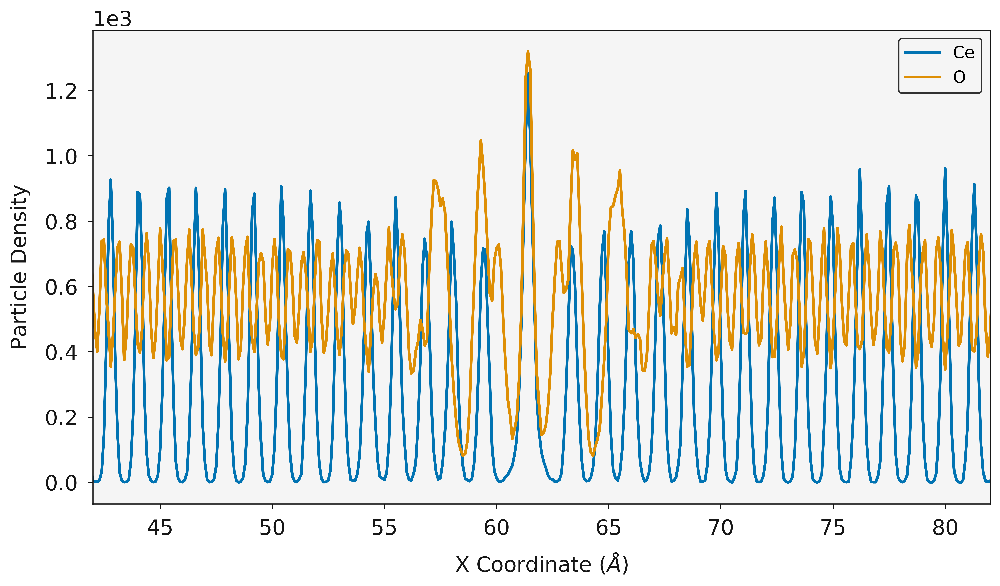

Charge Density
~~~~~~~~~~~~~~

The particle densities can be combined with the atom charges to generate the one dimensional charge density according to 

.. math::
    \rho_q(z) = \sum_{i} q_i \rho_i(z)

where :math:`\rho_{i}` is the density of atom i and :math:`q_{i}` is its charge.  

The one_dimensional_charge_density function requires a list of particle densities, list of charges and the bin volume. 

.. code-block:: python

    charge = analysis.OneDimensionalChargeDensity(ox, [oy, cy], [-2.0, 4.0], c_volume, history.trajectory.timesteps)
    dx, charge_density = charge.calculate_charge_density()

    ax = plotting.one_dimensional_charge_density_plot(dx, charge_density)
    ax.set_xlim(42, 82)
    plt.show()

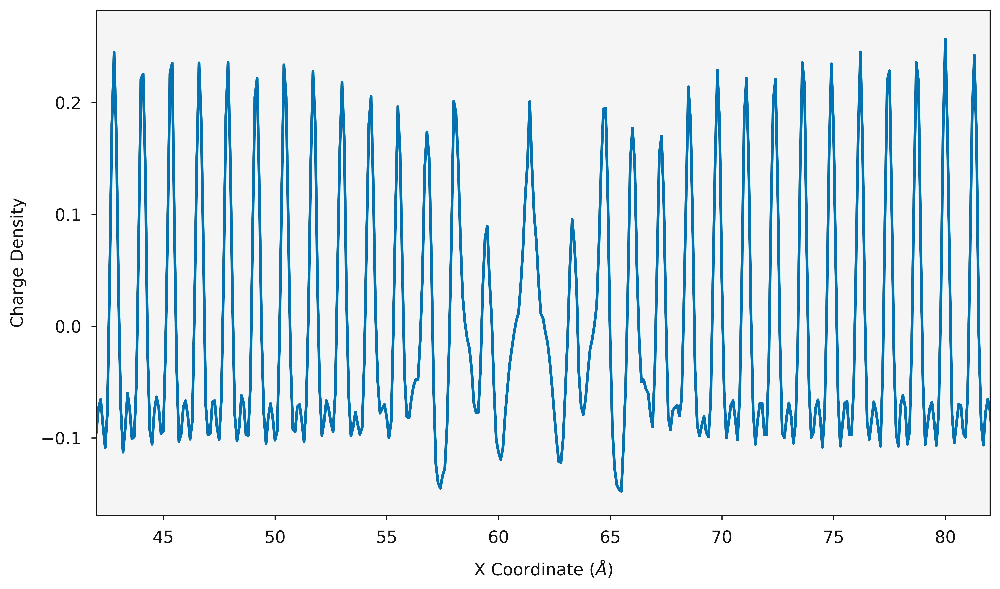

Electric Field and Electrostatic Potential
~~~~~~~~~~~~~~~~~~~~~~~~~~~~~~~~~~~~~~~~~~

The charge density can be converted into the electric field :math:`E(z)` and the electrostatic potential :math:`\Delta_{\psi}(z)`.

.. math::
    E(z) = \frac{1}{- \epsilon_{0}} \int_{z_{0}}^{z} \rho_{q}(z')dz'

.. math::
    \Delta_{\psi}(z) = \int_{z_{0}}^{z} E(z')dz'

where :math:`\rho_{i}` is the charge density and :math:`\epsilon_{0}` is the permittivity of free space
The calculate_electric_field and calculate_electrostatic_potential functions will take the bin positions, and the charge density and return the electric field and the electrostatic potential. 

.. code-block:: python

    dx, electric_field = charge.calculate_electric_field()

    ax = plotting.electric_field_plot(dx, electric_field)
    ax.set_xlim(42, 82)
    plt.show()

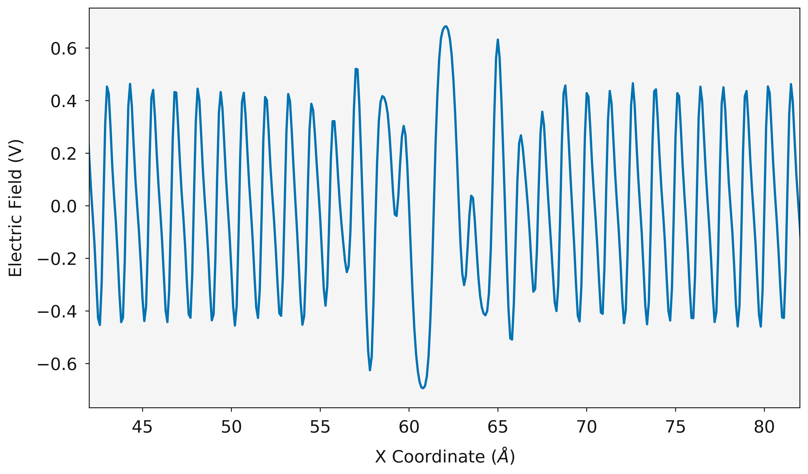

.. code-block:: python

    dx, electrostatic_potential = charge.calculate_electrostatic_potential()

    ax = plotting.electrostatic_potential_plot(dx, electrostatic_potential)
    ax.set_xlim(42, 82)
    plt.show()

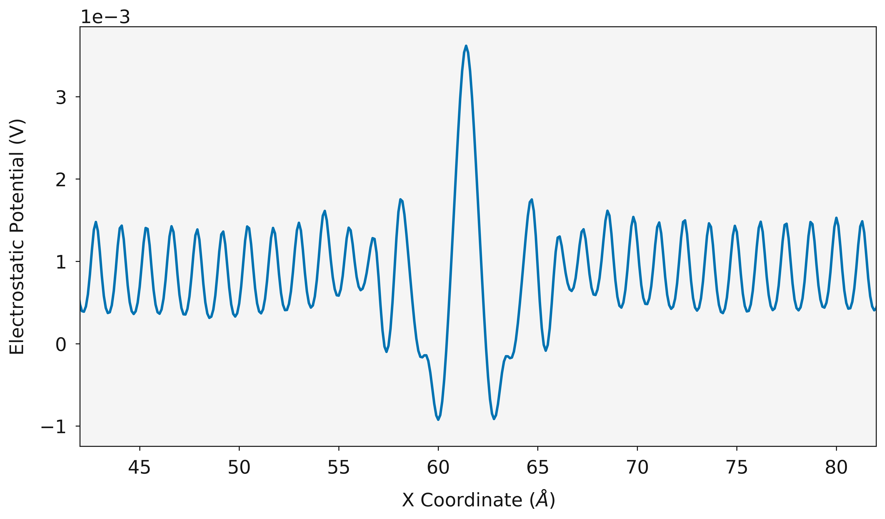

Two Dimensions
~~~~~~~~~~~~~~

The particle density can be evaluated in two dimensions. The two_dimensional_density function will calculate the total number of species in cuboids. The coordinates in x and y of the box are returned and a grid of species counts are returned. 

.. code-block:: python

    cx_2d, cy_2d, cz_2d, c_volume = ce_density.two_dimensional_density(direction="x")
    ox_2d, oy_2d, oz_2d, o_volume = o_density.two_dimensional_density(direction="x")

    fig, ax = plotting.two_dimensional_density_plot(cx_2d, cy_2d, cz_2d)
    plt.show()

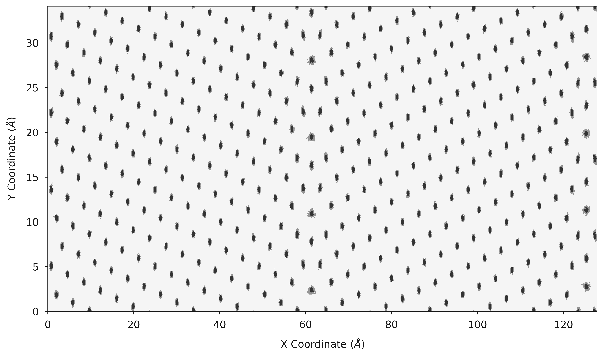

.. code-block:: python

    fig, ax = plotting.two_dimensional_density_plot(ox_2d, oy_2d, oz_2d)
    plt.show()

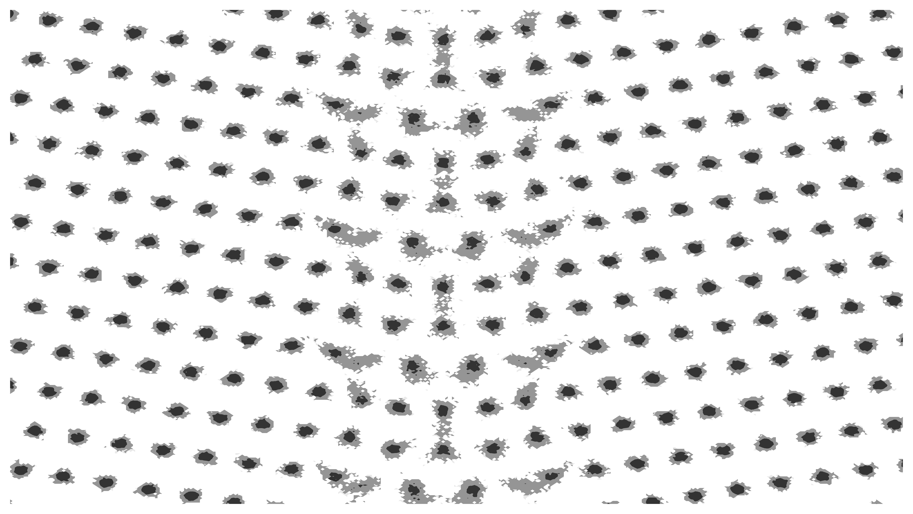

Charge Density
~~~~~~~~~~~~~~

In the same fashion as the one dimensional case, the charge density can be evaluated in two dimensions using the two_dimensional_charge_density function. 

.. code-block:: python

    charge_density = analysis.two_dimensional_charge_density([oz_2d, cz_2d], [-2.0, 4.0], o_volume)

    fig, ax = plotting.two_dimensional_charge_density_plot(ox_2d, oy_2d, charge_density)
    plt.show()

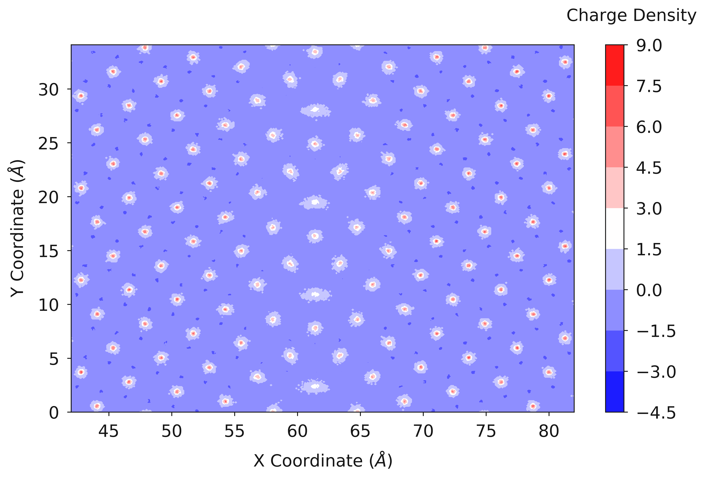

One and Two Dimensions
----------------------

The contour plots can give a good understanding of the average positions of the atoms (or the location of the lattice sites) however it does not give a good representation of how many species are actually there. The combined_density_plot function will evaluate the particle density in one and two dimensions and then overlay the two on to a single plot, allowing both the lattice sites, and total density to be viewed. 

.. code-block:: python

    fig, ax = plotting.combined_density_plot(cx_2d, cy_2d, cz_2d)
    plt.show()

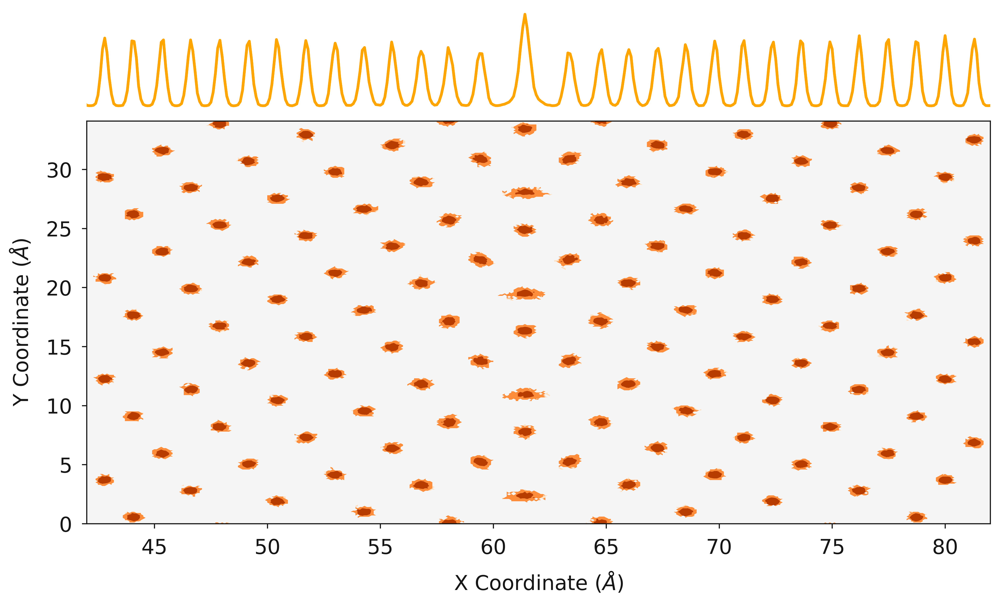

.. code-block:: python

    fig, ax = plotting.combined_density_plot(fx_2d, fy_2d, fz_2d)
    plt.show()

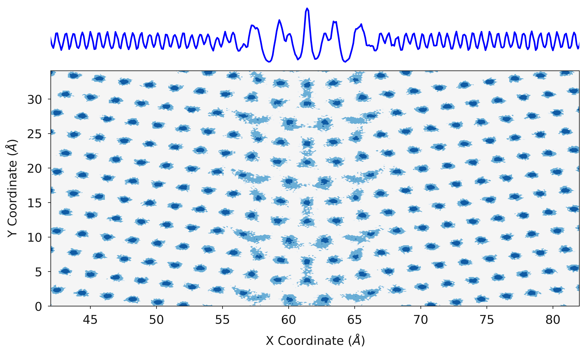

All Together
------------

Finally, :py:attr:`polypy.plotting` has some functions that will generate a single contour plot for all species. 

.. code-block:: python

    fig, ax = plotting.two_dimensional_density_plot_multiple_species([cx_2d, ox_2d], [cy_2d, oy_2d], [cz_2d, oz_2d], ["Blues", "Oranges"], log=True)
    plt.show()

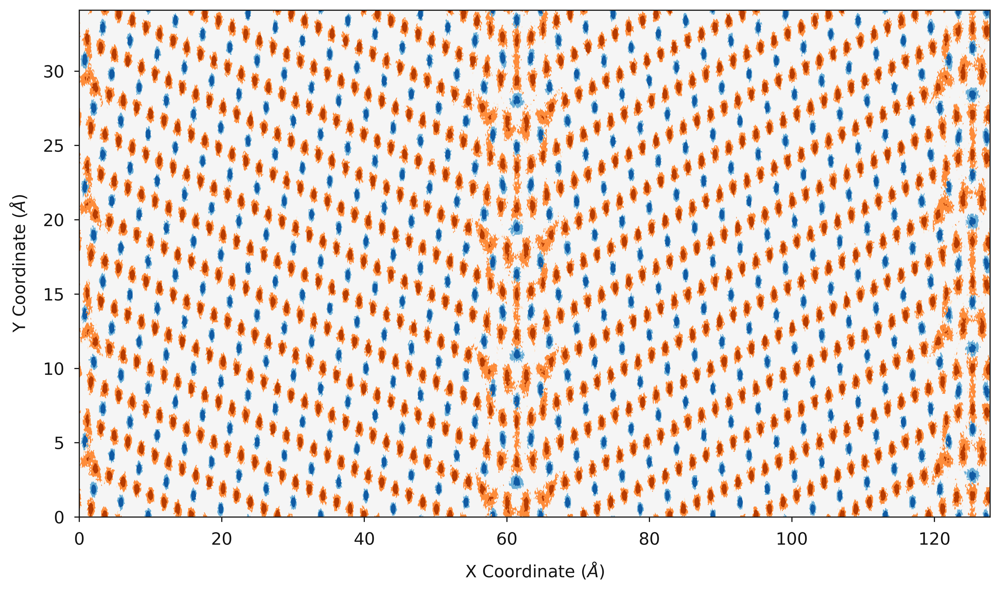

When analysing things like the electrostatic potetnial, it is useful to be able to view how the electrostatic potential changes with structure, it is very easy to use the :py:attr:`polypy.plotting` functions
in conjunction with matplotlib to visualise the relationships.

.. code-block:: python

    fig, ax = plotting.two_dimensional_density_plot_multiple_species([cx_2d, ox_2d], [cy_2d, oy_2d], [cz_2d, oz_2d], ["Blues", "Oranges"], log=True)
    ax.set_xlim(42, 82)
    ax2 = ax.twinx()
    ax2.plot(dx, electrostatic_potential, color="green")
    ax2.set_ylabel("Electrostatic Potential (V)")
    plt.show()

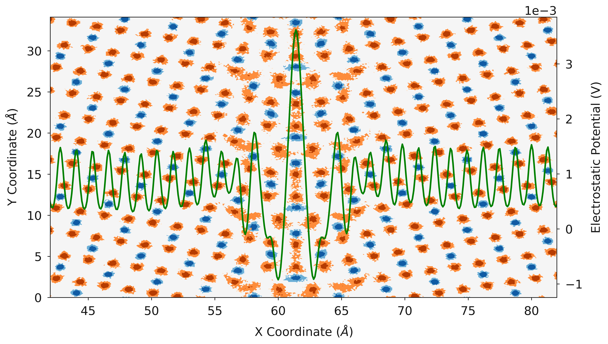

Finally, :py:attr:`polypy.plotting` can generate a contour plot showing the number density in one and two dimensions in a single plot.

.. code-block:: python

    fig, ax = plotting.combined_density_plot_multiple_species([cx_2d, ox_2d], [cy_2d, oy_2d], [cz_2d, oz_2d], ["Blues", "Oranges"], log=True)
    plt.show()

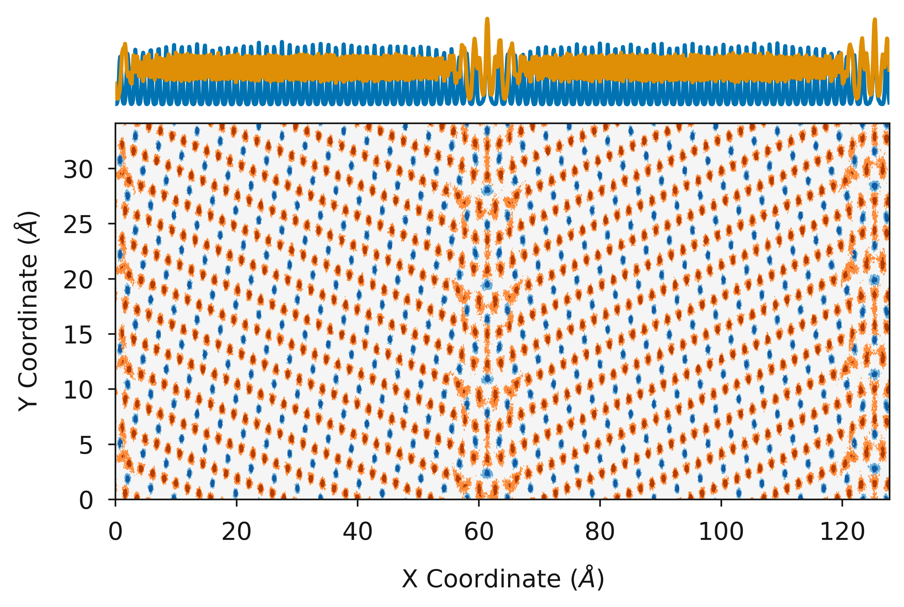