Atomic Density
==============

Density Analysis
----------------

Understanding the positions of atoms in a material is incredibly useful
when studying things like atomic structure and defect segregation.
Consider a system with an interface, it may be interesting to know how
the distributions of the materials atoms change at that interface, e.g
is there an increase or decrease in the amount of a certain species at
the interface and does this inform you about any segregation behaviour?

This module of polypy allows the positions of atoms in a simulation to
be evaluated in one and two dimensions, this can then be converted into
a charge density and (in one dimension) the electric field and
electrostatic potential.

.. code:: ipython3

    from polypy.read import History
    from polypy.read import Archive
    from polypy.density import Density
    from polypy import analysis
    from polypy import utils as ut
    from polypy import plotting
    
    import numpy as np
    import matplotlib.pyplot as plt
    import warnings
    warnings.filterwarnings('ignore')

In this tutorial, we will use polypy to analyse a molecular dynamics
simulation of a grain boundary in fluorite cerium oxide and a Monte
Carlo simulation of Al, Li and Li vacancy swaps in lithium lanthanum
titanate.

Example 1 - Cerium Oxide Grain Boundary
^^^^^^^^^^^^^^^^^^^^^^^^^^^^^^^^^^^^^^^

In this example we will use ``polypy`` to analyse a molecular dynamics
simulation of a grain boundary in cerium oxide.

The first step is to read the data. We want the data for both species so
need to provide a list of the species.

::

   ["CE", "O"]

Note. In all examples, an ``xlim`` has been specified to highlight the
grain boundary. Feel free to remove the ``ax.set_xlim(42, 82)`` to see
the whole plot.

.. code:: ipython3

    history = History("../example_data/HISTORY_GB", ["CE", "O"])
    
    print(np.amin(history.trajectory.cartesian_trajectory))
    print(np.amax(history.trajectory.fractional_trajectory))

.. parsed-literal::

    -63.929
    0.9999993486383602

The next step is to create the density object for both species. In this
example we create a seperate object for the cerium and oxygen atoms and
we will be analysing the positions to a resolution of 0.1 angstroms.

.. code:: ipython3

    ce_density = Density(history.trajectory, atom="CE", histogram_size=0.1)
    o_density = Density(history.trajectory, atom="O", histogram_size=0.1)

All subsequent analysis is performed on these two objects.

One Dimension
-------------

Particle Density
~~~~~~~~~~~~~~~~

The ``one_dimensional_density`` function will take a direction which
corresponds to a dimension of the simulation cell. For example, ‘x’
corresponds to the first lattice vector. The code will calculate the
total number of a species in 0.1 angstrom histograms along the first
cell dimension.

The function will return the positions of the histograms and the total
number of species. These can then be plotted with the
``one_dimensional_density_plot`` function which takes a list of
histogram values, a list of particle densities and a list of labels.

.. code:: ipython3

    cx, cy, c_volume = ce_density.one_dimensional_density(direction="z")
    ox, oy, o_volume = o_density.one_dimensional_density(direction="z")
    
    ax = plotting.one_dimensional_density_plot([cx, ox], [cy, oy], ["Ce", "O"])
    ax.set_xlim(42, 82)
    plt.show()

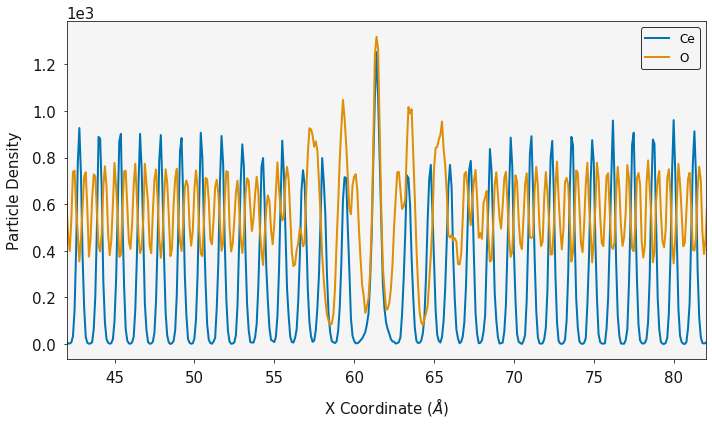

Charge Density
~~~~~~~~~~~~~~

The particle densities can be combined with the atom charges to generate
the one dimensional charge density according to

.. math::
    \rho_q(z) = \sum_{i} q_i \rho_i(z)

where :math:`\rho_{i}` is the particle density of atom i and
:math:`q_{i}` is its charge.

The ``OneDimensionalChargeDensity`` class is used for the charge
density, electric field and electrostatic potential. It requires a list
of particle densities, list of charges, the histogram volume and the
total number of timesteps.

.. code:: ipython3

    charge = analysis.OneDimensionalChargeDensity(ox, [oy, cy], [-2.0, 4.0], c_volume, history.trajectory.timesteps)
    
    dx, charge_density = charge.calculate_charge_density()
    
    ax = plotting.one_dimensional_charge_density_plot(dx, charge_density)
    ax.set_xlim(42, 82)
    
    plt.show()

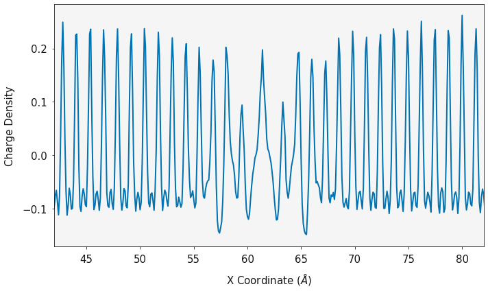

Electric Field and Electrostatic Potential
~~~~~~~~~~~~~~~~~~~~~~~~~~~~~~~~~~~~~~~~~~

The charge density can be converted into the electric field and the
electrostatic potential.

.. math::
    E(z) = \frac{1}{- \epsilon_{0}} \int_{z_{0}}^{z} \rho_{q}(z')dz'

.. math::
    \Delta_{\psi}(z) = \int_{z_{0}}^{z} E(z')dz'

where :math:`\rho_{i}` is the charge density and :math:`\epsilon_{0}` is
the permittivity of free space The ``calculate_electric_field`` and
``calculate_electrostatic_potential`` functions will return the electric
field and the electrostatic potential.

.. code:: ipython3

    dx, electric_field = charge.calculate_electric_field()
    
    ax = plotting.electric_field_plot(dx, electric_field)
    ax.set_xlim(42, 82)
    plt.show()

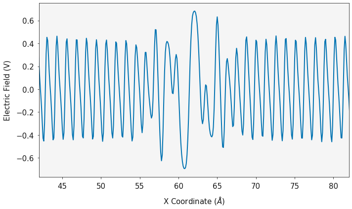

.. code:: ipython3

    dx, electrostatic_potential = charge.calculate_electrostatic_potential()
    
    ax = plotting.electrostatic_potential_plot(dx, electrostatic_potential)
    ax.set_xlim(42, 82)
    
    plt.show()

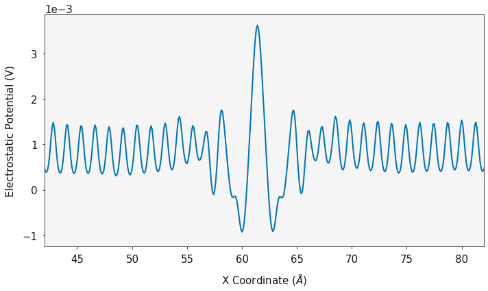

Two Dimensions
--------------

Particle Density
~~~~~~~~~~~~~~~~

The particle density can be evaluated in two dimensions. The
``two_dimensional_density`` function will calculate the total number of
species in histograms. The coordinates in x and y of the box are
returned and a grid of species counts are returned.

In this example, the colorbar has been turned off, we are using a grey
palette and the data is being plotted on a log scale.

.. code:: ipython3

    cx_2d, cy_2d, cz_2d, c_volume = ce_density.two_dimensional_density(direction="x")
    ox_2d, oy_2d, oz_2d, o_volume = o_density.two_dimensional_density(direction="x")
    
    fig, ax = plotting.two_dimensional_density_plot(cx_2d, cy_2d, cz_2d, colorbar=False, palette="Greys", log=True)
    ax.set_xlim(42, 82)
    ax.axis('off')
    plt.show()
    
    fig, ax = plotting.two_dimensional_density_plot(ox_2d, oy_2d, oz_2d, colorbar=False, palette="Greys", log=True)
    ax.set_xlim(42, 82)
    ax.axis('off')
    plt.show()

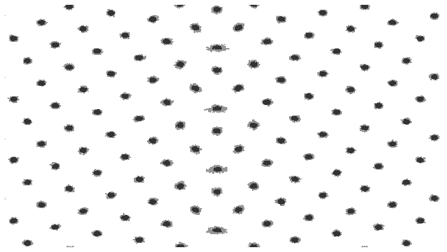

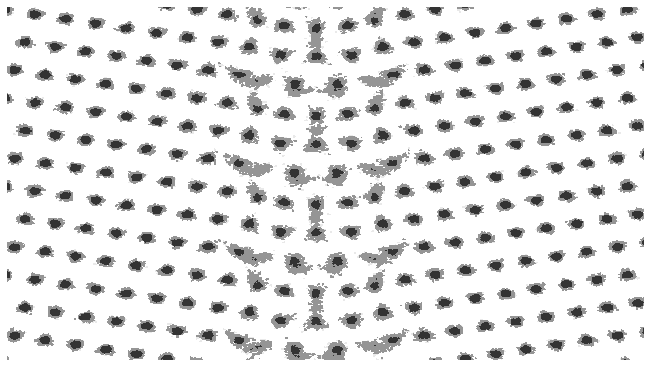

Charge Density
~~~~~~~~~~~~~~

In the same fashion as the one dimensional case, the charge density can
be evaluated in two dimensions using the
``two_dimensional_charge_density`` function. This function requires the
two dimensional array of atom positions, the atom charges, the volume at
each grid point and the total number of timesteps in the simulation.

.. code:: ipython3

    charge_density = analysis.two_dimensional_charge_density([oz_2d, cz_2d], [-2.0, 4.0], o_volume, history.trajectory.timesteps)
    
    fig, ax = plotting.two_dimensional_charge_density_plot(ox_2d, oy_2d, charge_density, palette='bwr')
    ax.set_xlim(42, 82)
    plt.show()

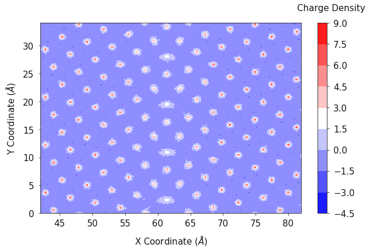

One and Two Dimensions
----------------------

The contour plots can give a good understanding of the average positions
of the atoms (or the location of the lattice sites) however it does not
give a good representation of how many species are actually there. The
``combined_density_plot`` function will evaluate the particle density in
one and two dimensions and then overlay the two on to a single plot,
allowing both the lattice sites, and total density to be viewed.

In this example we are using an orange palette and orange line color for
the cerium atoms, a blue palette and blue line for the oxygen positions
and the data is plotted on a log scale.

.. code:: ipython3

    fig, ax = plotting.combined_density_plot(cx_2d, cy_2d, cz_2d, palette="Oranges", linecolor="orange", log=True)
    for axes in ax:
        axes.set_xlim(42, 82)
    plt.show()
    
    fig, ax = plotting.combined_density_plot(ox_2d, oy_2d, oz_2d, palette="Blues", linecolor="blue", log=True)
    for axes in ax:
        axes.set_xlim(42, 82)
    plt.show()

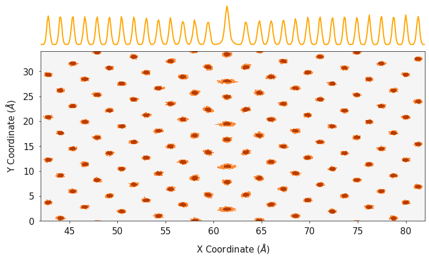

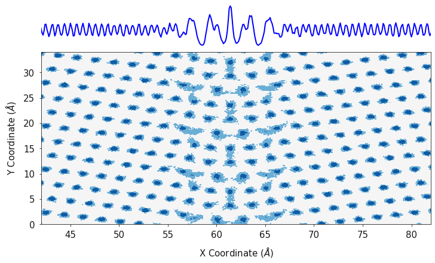

Putting it all together
~~~~~~~~~~~~~~~~~~~~~~~

Finally, ``polypy.plotting`` has some functions that will generate a
single contour plot for all species. This function requires the a list
of x axes, a list of y axes, a list of two dimensional arrays
corresponding to the x and y axes and a list of color palettes.

.. code:: ipython3

    fig, ax = plotting.two_dimensional_density_plot_multiple_species([cx_2d, ox_2d], [cy_2d, oy_2d], 
                                                                     [cz_2d, oz_2d], ["Blues", "Oranges"], 
                                                                     log=True)
    ax.set_xlim(42, 82)
    plt.show()

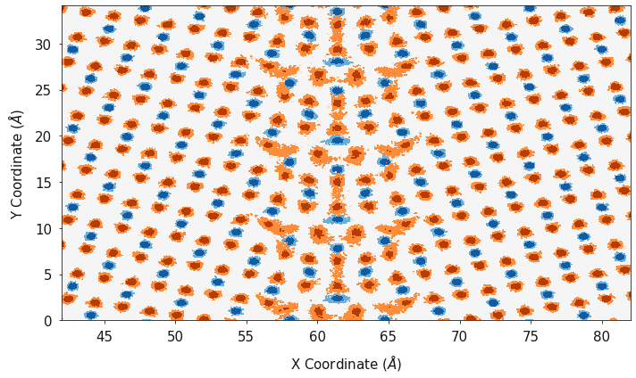

When analysing things like the electrostatic potential, it is useful to
be able to view how the electrostatic potential changes with structure,
it is very easy to use the ``polypy.plotting`` functions in conjunction
with matplotlib to visualise the relationships.

.. code:: ipython3

    fig, ax = plotting.two_dimensional_density_plot_multiple_species([cx_2d, ox_2d], [cy_2d, oy_2d], 
                                                                     [cz_2d, oz_2d], ["Blues", "Oranges"], 
                                                                     log=True)
    ax.set_xlim(42, 82)
    ax2 = ax.twinx()
    ax2.plot(dx, electrostatic_potential, color="green")
    ax2.set_ylabel("Electrostatic Potential (V)")
    plt.show()

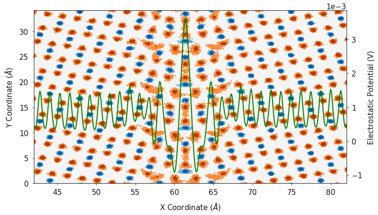

Finally, ``polypy.plotting`` can generate a contour plot showing the
number density in one and two dimensions in a single plot. This function
requires the a list of x axes, a list of y axes, a list of two
dimensional arrays corresponding to the x and y axes, a list of color
palettes, a list of labels and a list of line colors.

.. code:: ipython3

    fig, ax = plotting.combined_density_plot_multiple_species(x_list=[cx_2d, ox_2d], 
                                                              y_list=[cy_2d, oy_2d], 
                                                              z_list=[cz_2d, oz_2d], 
                                                              palette_list=["Blues", "Oranges"], 
                                                              label_list=['Ce', 'O'], 
                                                              color_list=["blue", "orange"],
                                                              log=True)
    for axes in ax:
        axes.set_xlim(42, 82)
    plt.show()

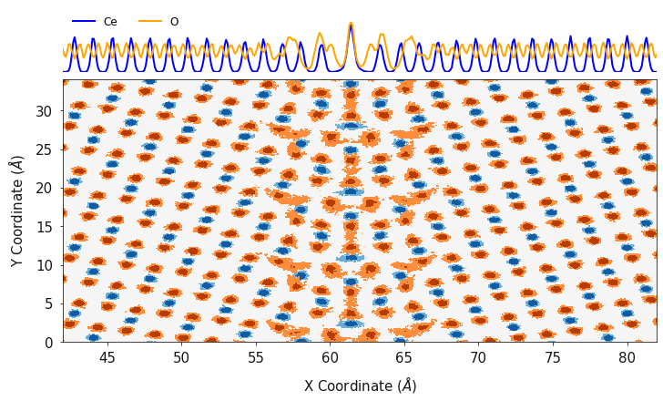

Example 2 - Li, Al and Li vacancy swaps
^^^^^^^^^^^^^^^^^^^^^^^^^^^^^^^^^^^^^^^

In this example we will analyse a Monte Carlo simulation of Al doped
lithium lanthanum titanate. It is possible to use molecular dynamics
simulations to study defect segregation if the defects have a relatively
high diffusion coefficient. One could randomly dope a configuration, run
a long molecular dynamics simulation and then analyse the evolution of
the defect locations. When the diffusion coefficient of your defect is
very low, it is not possible to use molecular dynamics simulations to
study defect segregation because you would need a huge MD simulation, in
order to record enough statistics. Monte Carlo simulations allow you to
perform unphysical moves and with a comparitively small Monte Carlo
simulation, you can generate enough statistics to reliably study things
like defect segregation.

In this example, we are analysing a MC simulation of Al in LLZO.
:math:`Al^{3+}` has been doped on the :math:`Li^{+}` sites and charge
compensating Li vacancies have been added. Ultimately, we want to
calculate how the Al doping effects the Li conductivity, however without
a representative distribution of Al/Li/Li vacancies we can’t calculate a
representative conductivity. After 10 ns of MD, the distribution of Al
was unchanged, so Monte Carlo simulations with swap moves are needed to
shake up the distribution. The following swap moves were used;

-  Al <-> Li
-  Al <-> :math:`V_{Li}`
-  Li <-> :math:`V_{Li}`

ARCHIVE_LLZO is a short MC trajectory that we will analyse.

First we will extract and plot the configuration at the first timestep
and then we will plot the positions across the whole simulation to see
how the distributions have changed.

.. code:: ipython3

    archive = Archive("../example_data/ARCHIVE_LLZO", ["LI", "AL", "LV"])
    config_1 = archive.trajectory.get_config(1)

Timestep 1
''''''''''

.. code:: ipython3

    li_density = Density(config_1, atom="LI", histogram_size=0.1)
    al_density = Density(config_1, atom="AL", histogram_size=0.1)
    lv_density = Density(config_1, atom="LV", histogram_size=0.1)

.. code:: ipython3

    lix, liy, li_volume = li_density.one_dimensional_density(direction="y")
    alx, aly, al_volume = al_density.one_dimensional_density(direction="y")
    lvx, lvy, lv_volume = lv_density.one_dimensional_density(direction="y")
    
    ax = plotting.one_dimensional_density_plot([lix, lvx, alx], [liy, lvy, aly], ["Li", "$V_{Li}$", "Al"])
    plt.show()

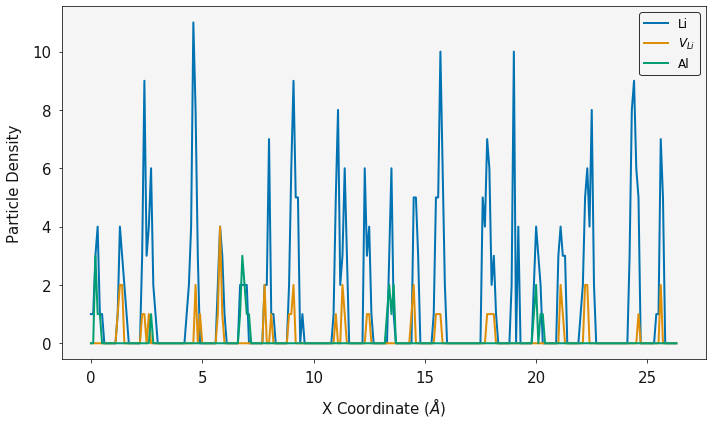

Full Simulation
'''''''''''''''

Disclaimer. This is a short snapshot of a simulation and is not fully
equilibriated, however it provides an example of the ``polypy``
functionailty.

Interestingly, what we find is that the Al, Li and :math:`V_{Li}` tend
to distribute in an even pattern within the structure. This is in sharp
contrast to the distribution at the start of the simulation.

.. code:: ipython3

    li_density = Density(archive.trajectory, atom="LI", histogram_size=0.1)
    al_density = Density(archive.trajectory, atom="AL", histogram_size=0.1)
    lv_density = Density(archive.trajectory, atom="LV", histogram_size=0.1)

.. code:: ipython3

    lix, liy, li_volume = li_density.one_dimensional_density(direction="y")
    alx, aly, al_volume = al_density.one_dimensional_density(direction="y")
    lvx, lvy, lv_volume = lv_density.one_dimensional_density(direction="y")
    
    ax = plotting.one_dimensional_density_plot([lix, lvx, alx], [liy, lvy, aly], ["Li", "$V_{Li}$", "Al"])
    plt.show()

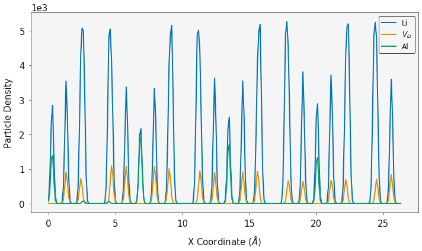

.. code:: ipython3

    lix_2d, liy_2d, liz_2d, li_volume = li_density.two_dimensional_density(direction="z")
    alx_2d, aly_2d, alz_2d, al_volume = al_density.two_dimensional_density(direction="z")
    lvx_2d, lvy_2d, lvz_2d, lv_volume = lv_density.two_dimensional_density(direction="z")

.. code:: ipython3

    fig, ax = plotting.two_dimensional_density_plot_multiple_species([alx_2d, lvx_2d], [aly_2d, lvy_2d], 
                                                                     [alz_2d, lvz_2d], ["Blues", "Oranges"], 
                                                                     log=True, figsize=(6, 6))
    plt.show()

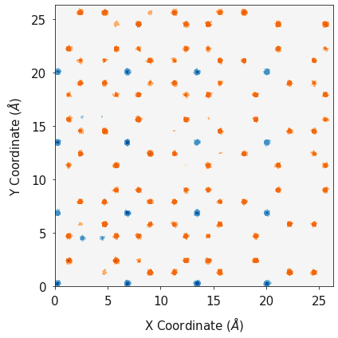

.. code:: ipython3

    fig, ax = plotting.combined_density_plot_multiple_species(x_list=[lix_2d, alx_2d, lvx_2d],
                                                              y_list=[liy_2d, aly_2d, lvy_2d], 
                                                              z_list=[liz_2d, alz_2d, lvz_2d],
                                                              palette_list=["Greens", "Blues", "Oranges"], 
                                                              label_list=["Li", 'Al', '$V_{Li}$'], 
                                                              color_list=["green", "blue", "orange"],
                                                              log=True, figsize=(6, 6))
    plt.show()

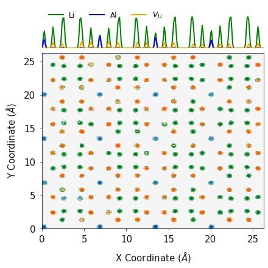

