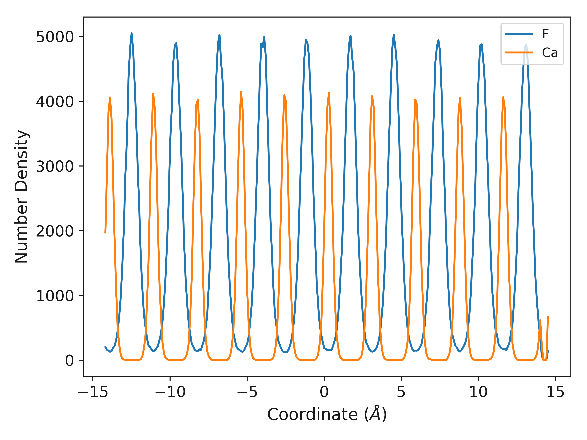
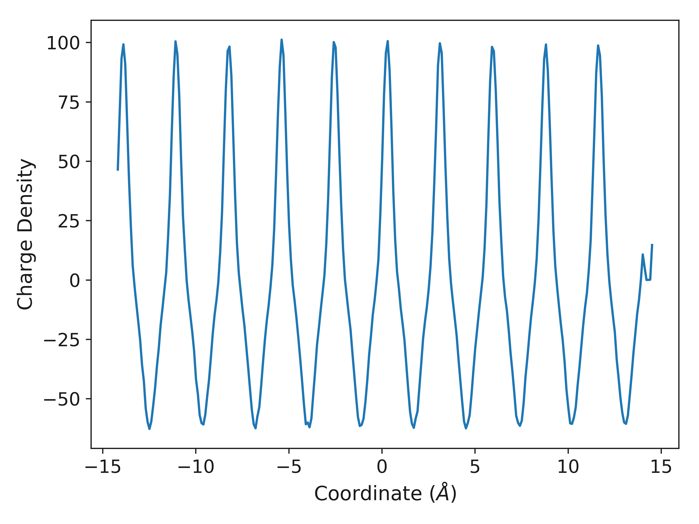

Density in One Dimension
========================

Many problems in material chemistry can be investigated through understanding the particle density. `polypy` allows the calculation of particle densities in one dimension, so histograms of particle density. 

The first step is to read the data. We want the data for both species so need to provide a list of the species.

.. code-block:: python

    from polypy import read as rd
    from polypy import density as Dens
    from polypy import utils as ut
    from polypy import write as wr
    import numpy as np  

    data = rd.read_history("../example_data/HISTORY", ["CA", "F"])

The next step is to create the density object for both species.

.. code-block:: python

    ca_density = Dens.Density(data, atom_type="CA")
    f_density = Dens.Density(data, atom_type="F")

Particle Density
~~~~~~~~~~~~~~~~

The one_dimensional_density function will take a bin size e.g. 0.1 angstoms and a direction e.g. the first lattice vector and calculate the total number of a species in 0.1 angstrom sized bins in the first lattice vector.

The function will return the positions of the bins and the total number of species. These can then be plotted with the one_dimensional_plot function which takes a list of x values, a list of y values and a list of labels. 

.. code-block:: python

    cx, cy = ca_density.one_dimensional_density(histogram_width=0.1, direction="x")
    fx, fy = f_density.one_dimensional_density(histogram_width=0.1, direction="x")

    wr.one_dimensional_density_plot([fx, cx], [fy, cy], ["F", "Ca"])

Charge Density
~~~~~~~~~~~~~~

The particle densities can be combined with the atom charges to generate the one dimensional charge density according to 

.. math::
    \rho_q(z) = \sum_{i} q_i \rho_i(z)

where :math:`\rho_{i}` is the density of atom i and :math:`q_{i}` is its charge.  

The one_dimensional_charge_density function requires a list of particle densities, list of charges and the bin volume. 

.. code-block:: python

    bin_volume = 0.1 * np.mean(data['lv'][:,1] * np.mean(data['lv'][:,2]))

    charge_density = ut.one_dimensional_charge_density([fy, cy],
                                                       [-1.0, 2.0],
                                                       bin_volume)

    wr.one_dimensional_charge_density_plot(fx, charge_density)

Electric Field and Electrostatic Potential
~~~~~~~~~~~~~~~~~~~~~~~~~~~~~~~~~~~~~~~~~~

The charge density can be converted into the electric field and the electrostatic potential.

.. math::
    E(z) = \frac{1}{- \epsilon_{0}} \int_{z_{0}}^{z} \rho_{q}(z')dz'

.. math::
    \Delta_{\psi}(z) = \int_{z_{0}}^{z} E(z')dz'

The poisson solver function will take the bin positions, and the charge density and return the electric field and the electrostatic potential. 

.. code-block:: python

    dx, e_field, potential = ut.poisson_solver(fx, charge_density,
                                               data['timesteps'])
    wr.electric_field_plot(dx, e_field)

.. image:: Figures/Electric_Field.png
    :height: 300px
    :align: center

.. code-block:: python

    wr.electrostatic_potential_plot(dx, potential)

.. image:: Figures/Electrostatic_Potential.png
    :height: 300px
    :align: center