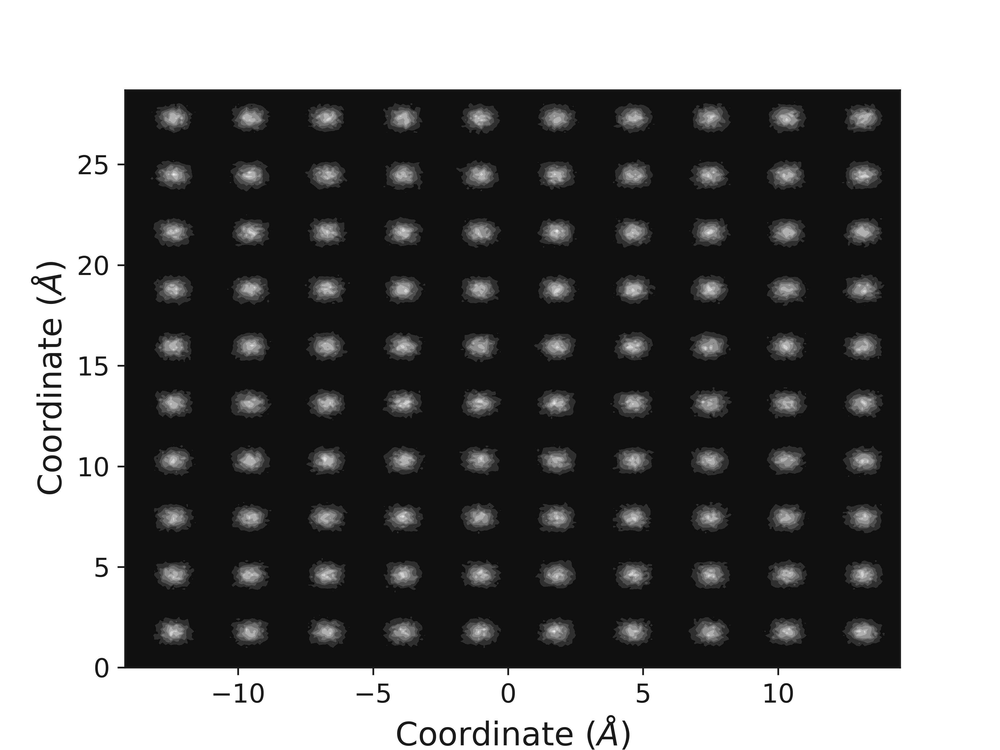
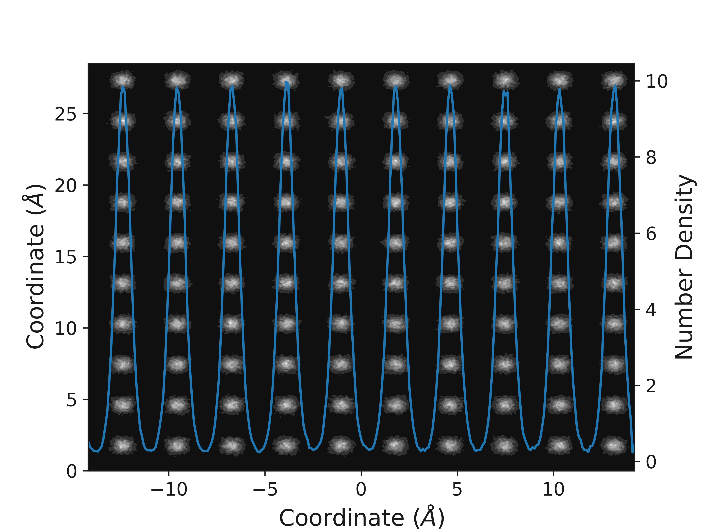

Density in Two Dimensions
=========================

Many problems in material chemistry can be investigated through understanding the particle density. `polypy` allows the calculation of particle densities in two dimensions. This is the next logical step up from the one dimensional approach. 

The first step is to read the data. We want the data for both species so need to provide a list of the species.

.. code-block:: python

    from polypy import read as rd
    from polypy import density as Dens
    from polypy import utils as ut
    from polypy import write as wr
    import numpy as np  

    data = rd.read_history("../example_data/HISTORY", ["CA", "F"])

The next step is to create the density object for both species.

.. code-block:: python

    ca_density = Dens.Density(data, atom_type="CA")
    f_density = Dens.Density(data, atom_type="F")

Particle Density
~~~~~~~~~~~~~~~~

The particle density can be evaluated in two dimensions. The two_dimensional_density function will calculate the total number of species in cuboids. The coordinates in x and y of the box are returned and a grid of species counts are returned. 

.. code-block:: python

    cx, cy, cz = ca_density.two_dimensional_density(box=0.1,
                                                    direction="x")
    fx, fy, fz = f_density.two_dimensional_density(box=0.1,
                                                   direction="x")

    wr.two_dimensional_density_plot(fx, fy, fz)

Charge Density
~~~~~~~~~~~~~~

In the same fashion as the one dimensional case, the charge density can be evaluated in two dimensions using the two_dimensional_charge_density function. 

.. code-block:: python

    box_volume = 0.1 * 0.1 * np.mean(data['lv'][:,0])

    charge_density = ut.two_dimensional_charge_density([fz, cz], 
                                                       [-1.0, 2.0],
                                                       box_volume)
    wr.two_dimensional_charge_density_plot(fx, fy, charge_density)

.. image:: Figures/2D_Charge_Density.png
    :height: 300px
    :align: center

One and Two Dimensions
----------------------

Finally, the contour plots can give a good understanding of the average positions of the atoms (or the location of the lattice sites) however it does not give a good representation of how many species are actually there. The one_and_two_dimensional_overlay function will evaluate the particle dnesity in one and two dimensions and then overlay the two on to a single plot, allowing both the lattice sites, and total density to be viewed. 

.. code-block:: python

    fx, fy, fz, fy2 = f_density.one_and_two_dimension_overlay(box=0.1)

    wr.combined_density_plot(fx, fy, fz, fy2)

