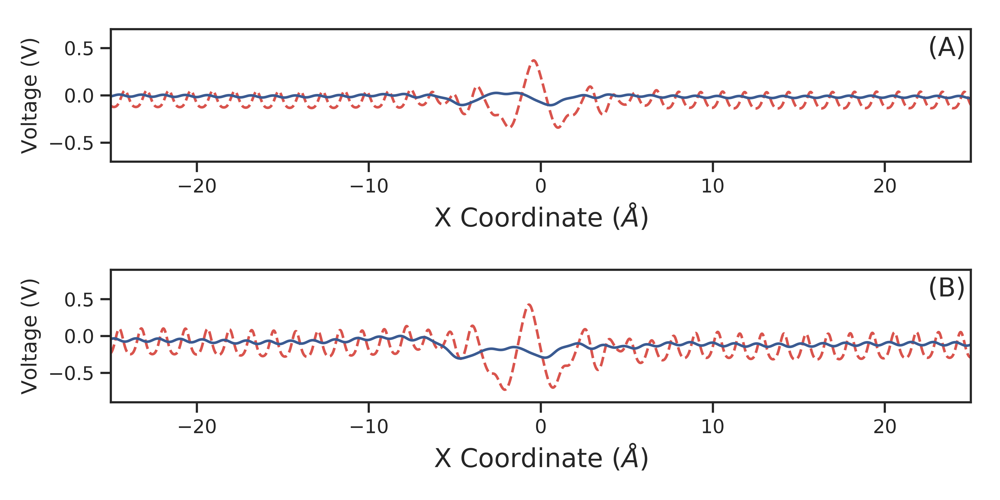
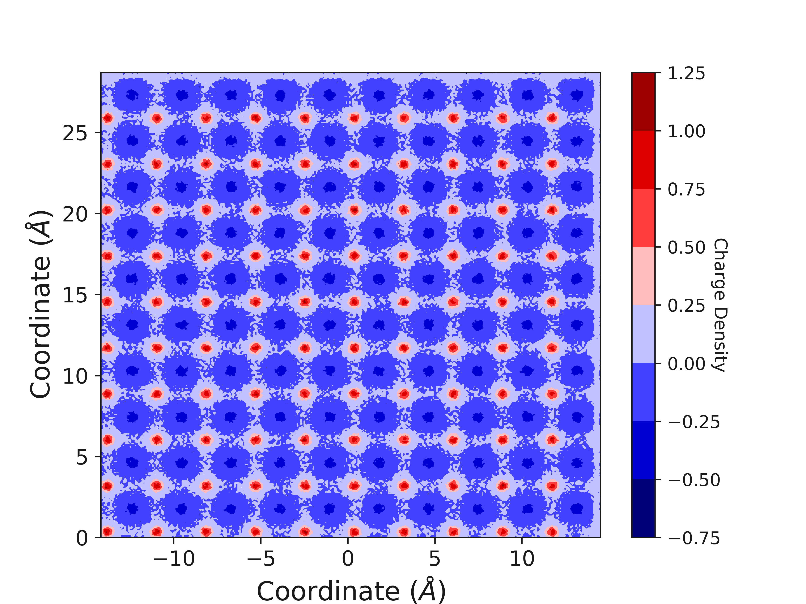

Gallery
=======

The gallery is a preview of some of the plots available in ``surfinpy``. Clicking on a plot will provide a link to a tutorial 
for generating the plot. 

Particle Density
----------------

The following are examples of the plots and outputs generated from the particle density in one and two dimensions.

One Dimension
~~~~~~~~~~~~~

The following are examples of plots generated from the one dimensional particle density. 

.. image:: Figures/Gallery/1D_Water.png
    :height: 300px
    :align: center
    :target: tutorial_2.html

.. image:: Figures/Gallery/1D_Particle_Density.png
    :height: 300px
    :align: center
    :target: tutorial_2.html

.. image:: Figures/Gallery/1D_Charge_Density.png
    :height: 300px
    :align: center
    :target: tutorial_2.html

Two Dimensions
~~~~~~~~~~~~~~

The following are examples of plots generated from the two dimensional particle density.

.. image:: Figures/Gallery/2D_Particle_Density.png
    :height: 300px
    :align: center
    :target: tutorial_2.html

One and Two Dimensions
~~~~~~~~~~~~~~~~~~~~~~

The following example shows a combination of one and two dimensions

Mean Squared Displacement
-------------------------

.. image:: Figures/Gallery/Smooth_MSD.png
    :height: 300px
    :align: center
    :target: tutorial_3.html
