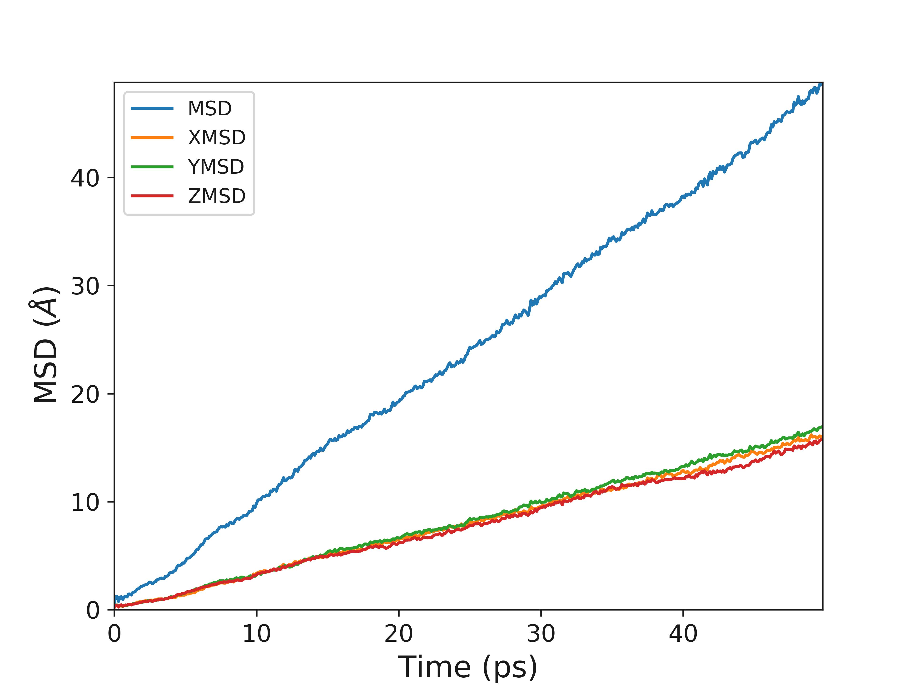
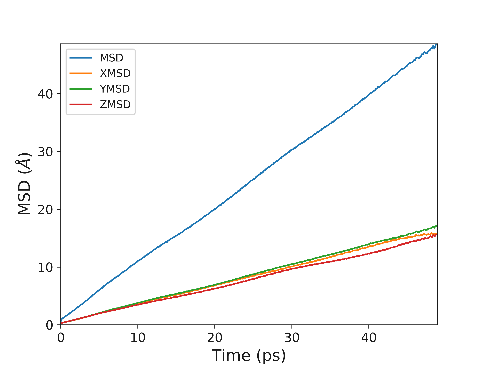
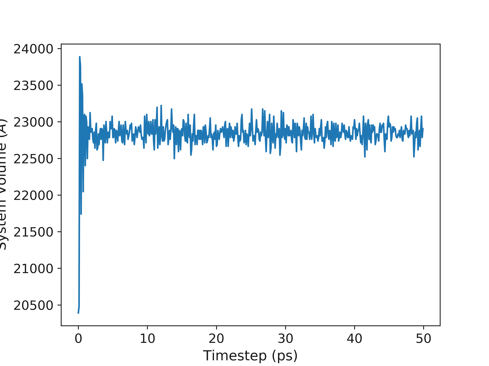
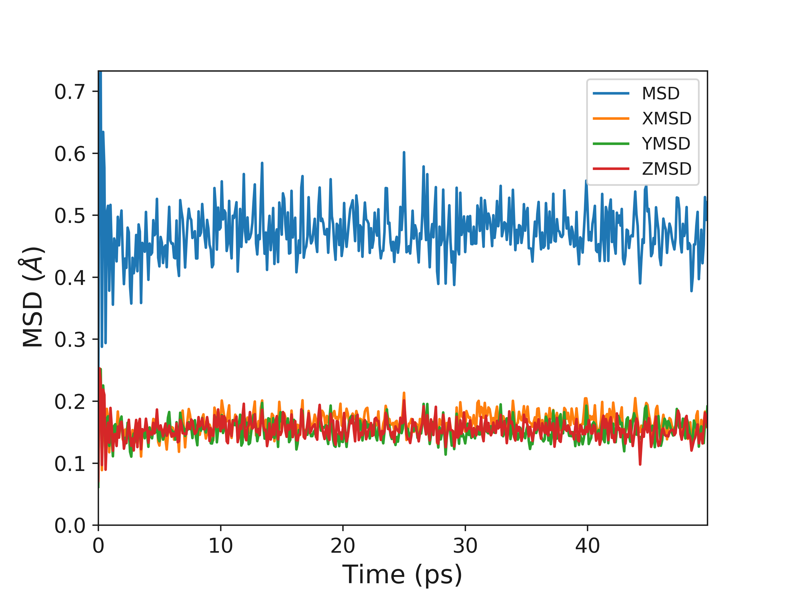

Mean Squared Displacement MSD
=============================

Molecules in liquds, gases and solids do not stay in the same place and move constantly. Think about a drop of dye in a glass of water, as time passes the dye distributes throughout the water. This process is called diffusion and is common throughout nature and an incredibly relevant property for materials scientists who work on things like batteries.  

Using the dye as an example, the motion of a dye molecule is not simple. As it moves it is jostled by collisions with other molecules, preventing it from moving in a straight path. If the path is examined in close detail, it will be seen to be a good approximation to a random walk. In mathmatics a random walk is a series of steps, each taken in a random direction. This was analysed by Albert Einstein in a study of Brownian motion and he showed that the mean square of the distance travelled by a particle following a random walk is proportional to the time elapsed. 

.. math::
    \Big \langle r_{i}^{2} \big \rangle = 6 D_t + C 

where 

.. math::
    \Big \langle r_{i}^{2} \big \rangle = \frac{1}{3} \Big< | r_{i}(t) - r_{i}(0) |^2 \Big>

where :math:`\Big \langle r^2 \big \rangle` is the mean squared distance, t is time, :math:`D_t` is the diffusion rate and C is a constant. If :math:`\Big \langle r_{i}^{2} \big \rangle` is plotted as a function of time, the gradient of the curve obtained is equal to 6 times the self-diffusion coefficient of particle i. 
The state of the matter effects the shape of the MSD plot, solids, where little to no diffusion is occuring, has a flat MSD profile. In a liquid however, the particles diffusion randomly and the gradient of the curve is proportional to the diffusion coefficient. 

What is the mean squared displacement
-------------------------------------

Going back to the example of the dye in water, lets assume for the sake of simplicity that we are in one dimension. Each step can either be forwards or backwards and we cannot predict which. From a given starting position, what distance is our dye molecule likely to travel after 1000 steps? This can be determined simply by adding together the steps, taking into account the fact that steps backwards subtract from the total, while steps forward add to the total. Since both forward and backward steps are equally probable, we come to the surprising conclusion that the probable distance travelled sums up to zero.

By adding the square of the distance we will always be adding positive numbers to our total which now increases linearly with time. Based upon equation 1 it should now be clear that a plot of :math:`\Big \langle r_{i}^{2} \big \rangle` vs time with produce a line, the gradient of which is equal to 6D. Giving us direct access to the diffusion coefficient of the system. 

Usage
~~~~~

.. code-block:: python

    from polypy import read as rd
    from polypy import msd as msd
    from polypy import utils as ut
    from polypy import write as wr
    import numpy as np

This example will use a short (50,000 steps), pre-prepared trajectory of bulk $CaF_2$. In reality we probably want a considerably longer simulation (~10,000,000 steps). Such simulations generate huge files (5GB) and the analysis would take too long for this tutorial. 

The first step is to read the history file to generate the data. The function read_history expects two things, the filename of the history file and a list of atoms to read. It will return a dictionary containing the atom labels, trajectories, lattice vectors, timesteps and number of atoms.

.. code-block:: python

    data = {'label': Atom Names,
            'trajectories': Atomic trajectories,
            'lv': Lattice vectors,
            'timesteps': Number of timesteps,
            'natoms': Number of Atoms}

.. code-block:: python

    data = rd.read_history("../example_data/HISTORY", ["F"])

Once the data has been read into the code the MSD calculation can be performed. The msd function requires the data and the time between records which in this case is 0.25ps. The msd function will then return a dictionary containing the time, 3D MSD and the directional components. 

.. code-block:: python

    data = {'msd': 3D MSD,
            'xmsd': MSD in the X direction,
            'ymsd': MSD in the Y direction,
            'zmsd': MSD in the Z direction,
            'time': Time}

.. code-block:: python

    timestep = 0.1
    msd_data = msd.msd(data, timestep)
    wr.msd_plot(msd_data)

Using the data the diffusion coefficient can then be calculated from the slopes. 

.. code-block:: python

    Diff = ut.linear_regression(msd_data['time'], msd_data['msd'])[0]
    Diffusion_Coefficient = ut.three_d_diffusion_coefficient(Diff)

    XDiff = ut.linear_regression(msd_data['time'], msd_data['xmsd'])[0]
    XDiffusion_Coefficient = ut.three_d_diffusion_coefficient(XDiff)

    YDiff = ut.linear_regression(msd_data['time'], msd_data['ymsd'])[0]
    YDiffusion_Coefficient = ut.three_d_diffusion_coefficient(YDiff)

    ZDiff = ut.linear_regression(msd_data['time'], msd_data['zmsd'])[0]
    ZDiffusion_Coefficient = ut.three_d_diffusion_coefficient(ZDiff)

    print("3D Diffusion Coefficient", Diffusion_Coefficient, "")
    print("1D Diffusion Coefficient in X", XDiffusion_Coefficient)
    print("1D Diffusion Coefficient in Y", YDiffusion_Coefficient)
    print("1D Diffusion Coefficient in Z", ZDiffusion_Coefficient)

| 3D Diffusion Coefficient 1.5982842660277743 
| 1D Diffusion Coefficient in X 0.5320682056322482
| 1D Diffusion Coefficient in Y 0.5560502622454371
| 1D Diffusion Coefficient in Z 0.510165798150089

Smoothing the MSD
~~~~~~~~~~~~~~~~~

This example has used one sweep of the trajectory, meaning that the MSD has been calculated from one value of :math:`r_{i}^{0}`. In order to increase your statistics and sharpen your  MSD plot it is often better to use multiple values of :math:`r_{i}^{0}`. Basically, use multiple starting points. The smooth_msd function allows you to increase the number of runs with the runs parameter.

.. code-block:: python

    smsd_data = msd.smooth_msd(data, timestep, runs=10)
    wr.msd_plot(smsd_data)

.. code-block:: python

    Diff = ut.linear_regression(smsd_data['time'], smsd_data['msd'])[0]
    Diffusion_Coefficient = ut.three_d_diffusion_coefficient(Diff)

    XDiff = ut.linear_regression(smsd_data['time'], smsd_data['xmsd'])[0]
    XDiffusion_Coefficient = ut.three_d_diffusion_coefficient(XDiff)

    YDiff = ut.linear_regression(smsd_data['time'], smsd_data['ymsd'])[0]
    YDiffusion_Coefficient = ut.three_d_diffusion_coefficient(YDiff)

    ZDiff = ut.linear_regression(smsd_data['time'], smsd_data['zmsd'])[0]
    ZDiffusion_Coefficient = ut.three_d_diffusion_coefficient(ZDiff)

    print("3D Diffusion Coefficient", Diffusion_Coefficient, "")
    print("1D Diffusion Coefficient in X", XDiffusion_Coefficient)
    print("1D Diffusion Coefficient in Y", YDiffusion_Coefficient)
    print("1D Diffusion Coefficient in Z", ZDiffusion_Coefficient)

| 3D Diffusion Coefficient 1.6183029417202661 
| 1D Diffusion Coefficient in X 0.5433783214892426
| 1D Diffusion Coefficient in Y 0.567069634210256
| 1D Diffusion Coefficient in Z 0.5078549860207675

Ionic Conductivity
~~~~~~~~~~~~~~~~~~

Usefully, as we have the diffusion coefficient, the number of particles (charge carriers) and the ability to calculate the volume, we can convert this data into the ionic conductivity and then the resistance. 

.. math::
    \sigma = \frac{D C_F e^2}{k_B T} 

where :math:`\sigma` is the ionic conductivity, D is the diffusion coefficient, :math:`C_F` is the concentration of charge carriers, which in this case if F ions, :math:`e^2` is the charge of the diffusing species, :math:`k_B` is the Boltzmann constant and T is the temperature. 

The resitance can then be calculated according to 

.. math::
    \Omega = \frac{1}{\sigma} 

So the first step is to calculate the volume, the system voume module will do this from the given data. 

.. code-block:: python

    volume, time = ut.system_volume(data, timestep)
    wr.volume_plot(time, volume)
    Average_Volume = np.mean(volume[100:])

.. code-block:: python

    Number_of_Charge_Carriers = data['natoms']
    Ionic_Conductivity = ut.conductivity(Number_of_Charge_Carriers, Average_Volume, Diffusion_Coefficient, 1500)
    print("Ionic Conductivity :", Ionic_Conductivity)

Ionic Conductivity : 87.79838348237887

.. code-block:: python

    print("Resistivity :", (1 / Ionic_Conductivity)) 

Resistivity : 0.01138973134056278

Simulation Length
~~~~~~~~~~~~~~~~~

It is important to consider the lenght of your simulation (Number of steps). The above examples use a short trajectory but it is at a sufficient temperature that there are enough diffusion events to get a good MSD plot. The following example is of a very short simulation, you will hopefully note that the MSD plot is clearly not converged.

.. code-block:: python

    data_short = rd.read_history("../example_data/HISTORY_short", ["F"])
    msd_data = msd.msd(data_short, timestep)
    wr.msd_plot(msd_data)

.. image:: Figures/Short_MSD.png
    :height: 300px
    :align: center

.. code-block:: python

    Diff = ut.linear_regression(msd_data['time'], msd_data['msd'])
    Diffusion_Coefficient = ut.three_d_diffusion_coefficient(Diff)

    XDiff = ut.linear_regression(msd_data['time'], msd_data['xmsd'])
    XDiffusion_Coefficient = ut.three_d_diffusion_coefficient(XDiff)

    YDiff = ut.linear_regression(msd_data['time'], msd_data['ymsd'])
    YDiffusion_Coefficient = ut.three_d_diffusion_coefficient(YDiff)

    ZDiff = ut.linear_regression(msd_data['time'], msd_data['zmsd'])
    ZDiffusion_Coefficient = ut.three_d_diffusion_coefficient(ZDiff)

    print("3D Diffusion Coefficient", Diffusion_Coefficient, "")
    print("1D Diffusion Coefficient in X", XDiffusion_Coefficient)
    print("1D Diffusion Coefficient in Y", YDiffusion_Coefficient)
    print("1D Diffusion Coefficient in Z", ZDiffusion_Coefficient)

| 3D Diffusion Coefficient 0.5634151782976387 
| 1D Diffusion Coefficient in X 0.3992597872198792
| 1D Diffusion Coefficient in Y 0.3940545927718295
| 1D Diffusion Coefficient in Z 0.3867199592864265

State of Matter
~~~~~~~~~~~~~~~

It is possible to identify the phase of matter from the MSD plot.

.. image:: Figures/States_of_Matter.png
    :height: 300px
    :align: center

The Fluorine diffusion discussed already clearly shows that the fluorine sub lattice has melted and the diffusion is liquid like. Whereas, carrying out the same analysis on the Calcium sub lattice shows that while the fluorine sub lattice has melted, the Calcium sub lattice is still behaving like a solid. 

.. code-block:: python

    data = rd.read_history("../example_data/HISTORY", ["CA"])
    msd_data = msd.msd(data, timestep)
    wr.msd_plot(msd_data)

