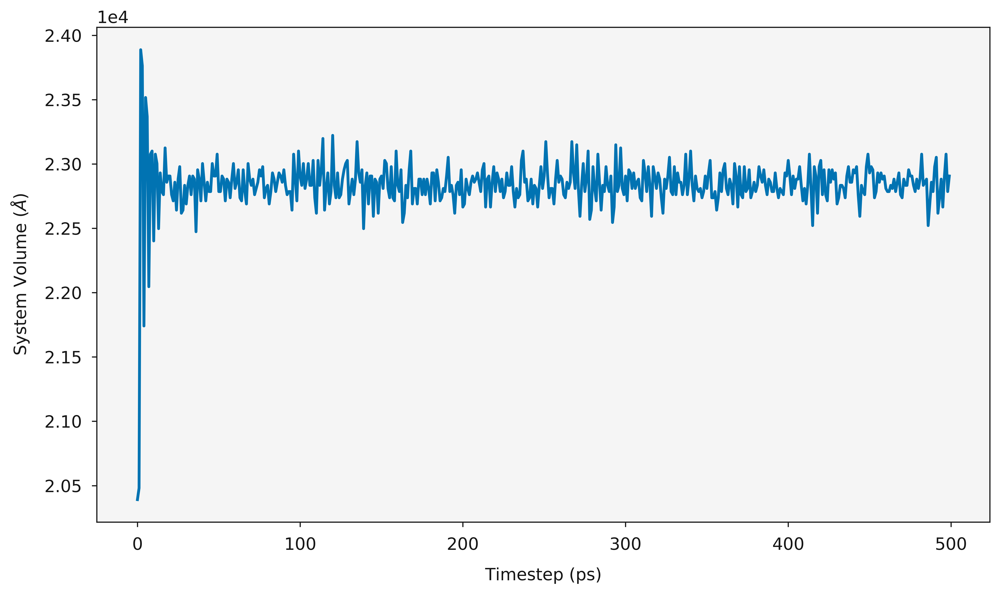

Volume
======

.. code-block:: python

    from polypy import analysis
    from polypy import plotting
    from polypy import read as rd
    import matplotlib.pyplot as plt

    history = rd.History("../example_data/HISTORY_CaF2", ["CA"])

    volume, step = analysis.system_volume(history.trajectory)

    ax = plotting.volume_plot(step, volume)
    plt.show()

